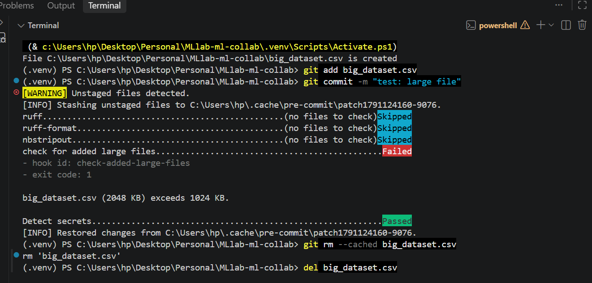
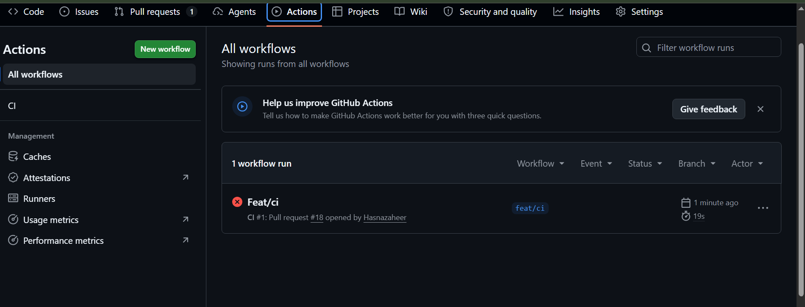
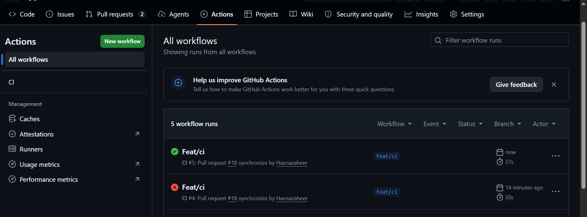

# MLLab ML Collaboration — Final Report

Repository: https://github.com/Hasnazaheer/MLlab-ml-collab

## 1. Team, roles, dataset and starter code

| Member | GitHub | Role |
|---|---|---|
| Hasna Zaheer | `Hasnazaheer` | Data Owner |
| Muhammad Tayyab | `tyb01` | Model Owner |

- **Dataset:** Titanic (binary classification, target `Survived`), from Kaggle:
  https://www.kaggle.com/c/titanic/data
- **Starter code:** the `titanic.ipynb` notebook supplied with the lab, refactored into
  `src/` in PR #2: https://github.com/Hasnazaheer/MLlab-ml-collab/pull/2

## 2. Reproducibility table

Released model, tag `model-v1.0`:

| Item | Value |
|---|---|
| Commit SHA | `e899b6ddd404e8ed553f945cbc2626fc6785c6ca` |
| `params.yaml` | `seed: 42`, `split.test_size: 0.2`, `train.model: random_forest`, `train.n_estimators: 50`, `train.max_depth: 10` |
| Seed | 42 |
| Data `.dvc` hash (`data/raw/train.csv.dvc`) | md5 `60f1e0596f5db46961ced72d593736e2` |
| Lock file (`dvc.lock`) | md5 `482d4727c89764b3e400f84ef7bb9f20` |
| accuracy | 0.7921348314606742 |
| precision | 0.7313432835820896 |
| recall | 0.7205882352941176 |
| f1 | 0.725925925925926 |
| roc_auc | 0.8064839572192513 |

Hasna reproduced these metrics exactly from a fresh clone of `staging` with
`uv sync`, `dvc pull` and `dvc repro`.

## 3. Experiment comparison

Output of `dvc exp show` (file-hash columns omitted).

**Tayyab: `n_estimators`**

| Experiment | accuracy | precision | recall | f1 | roc_auc | train.n_estimators | train.max_depth |
|---|---|---|---|---|---|---|---|
| exp/tayyab-n-estimators (baseline) | 0.8324 | 0.81967 | 0.72464 | 0.76923 | 0.85237 | 100 | 6 |
| ├── 0f95a17 [tayyab-n-est-300] | 0.8324 | 0.83051 | 0.71014 | 0.76562 | 0.84776 | 300 | 6 |
| ├── 3409592 [tayyab-n-est-200] | 0.8324 | 0.83051 | 0.71014 | 0.76562 | 0.8504 | 200 | 6 |
| └── 5936dd8 [tayyab-n-est-50] | 0.8324 | 0.80952 | 0.73913 | 0.77273 | 0.85138 | 50 | 6 |

**Hasna: `max_depth`**

| Experiment | accuracy | precision | recall | f1 | roc_auc |
|---|---|---|---|---|---|
| main | 0.79213 | 0.73134 | 0.72059 | 0.72593 | 0.80648 |
| ├── 4f503b6 [hasna-depth-8] | 0.82022 | 0.8 | 0.70588 | 0.75 | 0.81517 |
| ├── dfff189 [hasna-depth-6] | 0.82022 | 0.81034 | 0.69118 | 0.74603 | 0.83984 |
| └── 71ecbd9 [hasna-depth-4] | 0.81461 | 0.78689 | 0.70588 | 0.74419 | 0.84766 |

**Why the winner was chosen**

- `tayyab-n-est-50`: all four settings have the same accuracy; 50 trees gives the best
  F1 and recall and is the smallest model. Merged in PR #10.
- `hasna-depth-8`: ties for the best accuracy and has the best F1.

## 4. Links

| Item | Link |
|---|---|
| Data-update PR | https://github.com/Hasnazaheer/MLlab-ml-collab/pull/11 |
| Conflict-resolution PR | https://github.com/Hasnazaheer/MLlab-ml-collab/pull/11 |
| "Changes requested" review | https://github.com/Hasnazaheer/MLlab-ml-collab/pull/16 |
| Release PR, `dev` → `staging` | https://github.com/Hasnazaheer/MLlab-ml-collab/pull/20 |
| Release PR, `staging` → `main` | https://github.com/Hasnazaheer/MLlab-ml-collab/pull/21 |
| Abandoned `exp/` branch | https://github.com/Hasnazaheer/MLlab-ml-collab/tree/exp/tayyab-n-est-200 |

## 5. Screenshots

### Blocked large file

### Failing CI check

### Passing CI check

## 6. Retrospective

**What broke**

- `max_depth` was changed in `params.yaml` (PRs #12 and #13) without re-running the
  pipeline, so `dvc.lock` and `metrics.json` no longer matched the parameters.
- After the conflict in PR #11, `params.yaml` and `dvc.lock` did not describe the same
  run.
- `dvc push` worked but the DagsHub page was empty, because the DagsHub repository was
  not connected to GitHub. We recreated it as a connected repository.

**What we added to CONTRIBUTING.md because of it**

- Pull requests use merge commits, and `dev`, `staging` and `main` only change through
  pull requests, promoted `dev` → `staging` → `main`.
- If `dvc.lock` or `metrics.json` conflict, run `uv run dvc repro` after resolving
  instead of picking one side by hand.

## 7. Each member's contribution

### Hasna Zaheer — Data Owner

I created the project structure and the pre-commit configuration (PR #1). I set up DVC
with the DagsHub remote and tracked the dataset (PR #6). I wrote the EDA notebook
(PR #8). I updated the dataset by removing rows with missing `Embarked` and resolved the
conflict in `dvc.lock` and `metrics.json` (PR #11). I wrote the GitHub Actions CI
workflow and showed a failing and a passing run (PR #18). I ran three `max_depth`
experiments (4, 6, 8) and reproduced the released metrics from a fresh clone. I reviewed
and merged PRs #2, #4, #9, #16, #19, #20 and #21, and requested changes on PR #16.

### Muhammad Tayyab — Model Owner

I refactored the starter notebook into `src/` and set up the uv environment (PR #2). I
built the `prepare`, `train` and `evaluate` DVC stages, moved the seed, split ratio and
hyperparameters into `params.yaml`, fixed data leakage in imputation, and made the
evaluate stage write `metrics.json` with the commit SHA (PR #9). I ran three
`n_estimators` experiments (50, 200, 300) and merged the winner (PR #10). I wrote the
unit tests, opened the release PRs #20 and #21, and created the tag `model-v1.0`. I
reviewed and merged PRs #1, #6, #8, #11, #13, #14, #17 and #18.
